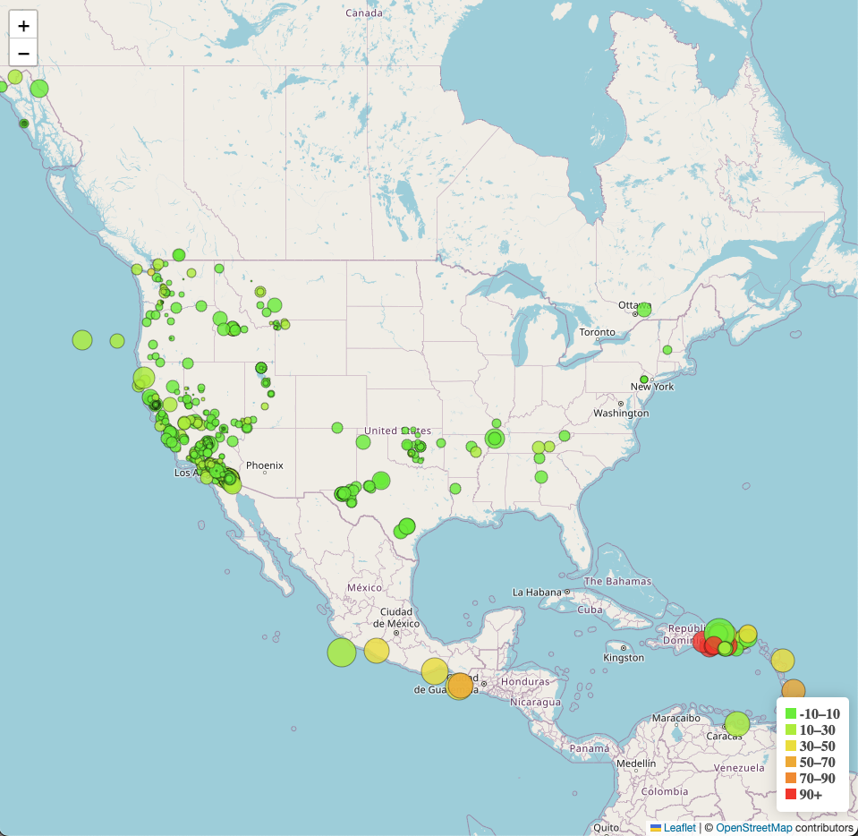

# Module-15-Mapping

This module assignment involved plotting the GeoJSON data using the Leaflet JS mapping tool. The data was from the United States Geological Society and showed earthquakes over the last seven days. The JavaScript file [logic.js](static/js/logic.js) holds the code for creating the interactive map. Both the CSS styling and the JavaScript files can be found in the [static folder](static). The [index.html](index.html) file holds the HTML code and links to the [Leaflet Library](https://leafletjs.com/) for visualisation and [D3 Libray](https://d3js.org/) to read the GeoJSON data. 

Below is the Map Visualisation created for the earthquake data using Leaflet JS.

